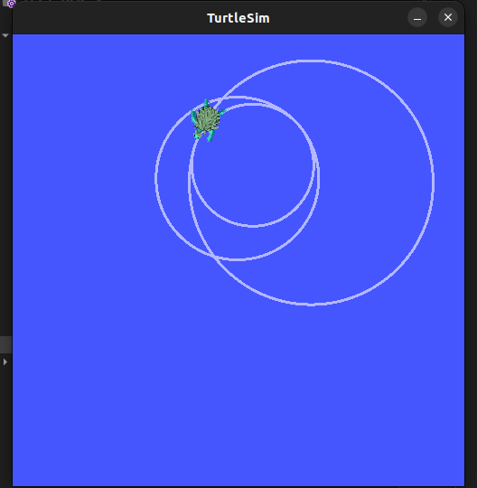
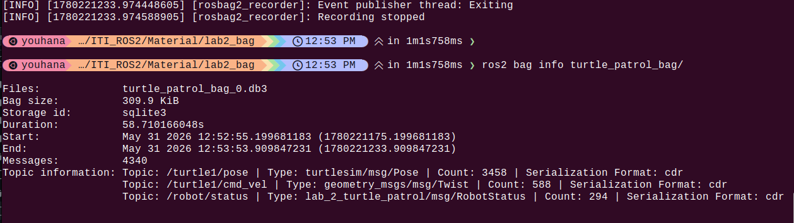

# Lab 2 : Core Concepts 2 (Custom Interfaces, Services, Parameters & Bags)

## Deliverables

- [x] The Package: A functional simple_turtle_patrol package.
- [x]  Visual Output: screenshots of turtlesim showing the circular path with 2 different diameters.
    

- [x]  Data Log: A 1-2 minute bag file (turtle_patrol_bag) containing data of the turtle moving, then being stopped, then continuing, and finally changing the rotation radius.
- [x]  Bag Metadata: A screenshot of the terminal showing the output of ros2 bag info turtle_patrol_bag.

